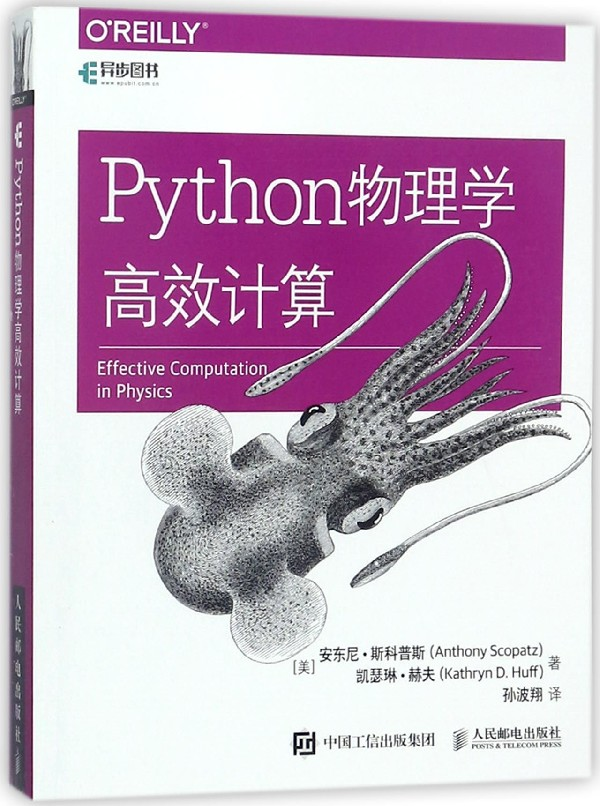

## Tianmao Spider😼😻🙀

基于requests+XPath+proxy-ip，爬取天猫商城关于Python的图书信息以及相应的图书封面图

## Results
-   抓取的部分图书商铺信息如下:
```
  书名	      价格	      月成交量	     评价数	       店铺
Python数据分析与应用 NumPy数值计算基础教程书籍 Matplotlib数据可视化基础 pandas统计分析 pandas进行数据预处理算法教程书籍	32.80	17笔	39	山东书虫图书专营店
【官方正版】 Python程序设计 董付国 Python程序设计 清华大学出版社 Python程序设计 第2版 Python程序设计 第二版 python董付国	39.20	163笔	148	清华大学出版社官方旗舰店
【当当网 正版书籍】python金融大数据分析 python基础教程 python书籍 笨办法学python 网络金融	49.50	61笔	93	当当网官方旗舰店
Python数据分析与应用 NumPy数值计算基础教程书籍 Matplotlib数据可视化基础pandas统计分析 pandas进行数据预处理算法教程书籍	32.80	75笔	77	布克图书专营店
Python编程 书籍 计算机	154.40	0笔	0	华清苑图书专营店
新华书店 原装 Python编程 书籍 计算机	156.40	0笔	0	卓越畅想图书专营店
Python高手之路 第3版	52.80	3笔	1	当当网官方旗舰店
现货 高教版 2019年全国计算机等级考试二级教程 Python语言程序设计+冲刺试卷 含线上题库 共2本 计算机二级Python教材配套书籍	59.90	38笔	5	山西春雨图书专营店
现货 量化投资 以Python 为工具 Python语言处理数据Python金融 量化投资Python实战入门书籍 量化投资理论分析书 金融投诉管理书	61.80	19笔	31	旷氏文豪图书专营店
Python数据处理+Python数据分析基础 2本套装 全面掌握用Python进行爬虫抓取以及数据清洗与分析的方法 Python数据技术书籍	118.00	10笔	18	兰兴达图书专营店
天猫  Python黑帽子：黑客与渗透测试编程之道  书籍 计算机	43.50	0笔	0	卓越畅想图书专营店
【官方正版】高教版2019年3月全国计算机等级考试二级教程 Python语言程序设计 教材+冲刺试卷 含上机题库 计算机二级Python教材	65.80	19笔	71	布克图书专营店
正版 算法与程序设计基础(Python版) 吴萍 清华大学出版社 清华版 21世纪高等学校计算机基础实用规划教材	34.90	9笔	13	世纪高教图书专营店
【官方正版】 算法与程序设计基础 Python版 21世纪 计算机基础实用规划教材 程序设计 研究生本科专科教材 工学	31.20	12笔	12	清华大学出版社官方旗舰店
Python趣味编程入门	37.24	0笔	1	微博图书旗舰店
深度学习入门 基于Python的理论与实现	44.84	0笔	0	微博图书旗舰店
安全技术大系5本白帽子讲Web扫描+Web安全深度剖析+漏洞战争:软件漏洞分析精要+Python绝技+软件保护及分析技术计算机网络安全书籍	298.80	1笔	1	中译图书专营店
Python神经网络编程+深度学习中文版+机器学习 3册套装 人工智能深度学习入门书 AI圣经 神经网络机器学习方法 python学习教程书籍	212.00	6笔	5	山西春雨图书专营店
跟老齐学Python Django实战	51.75	0笔	0	凤凰新华书店旗舰店
Python大学教程 吕云翔 赵天宇 张元 著 Python基础教程书籍 Python语言程序设计方法及其应用 python基础语法 计算机教材	31.08	0笔	1	电子工业出版社旗舰店
从芯片到云端 Python物联网全栈开发实践 python全栈开发 物联网设备云计算数据分析工程 框架软硬件编程序设计	88.06	0笔	5	电子工业出版社旗舰店
Python机器学习与量化投资+零起点 Python大数据与量化交易+机器学习快速入门+TensorFlow快速入门 共4册Python量化投资入门图书籍	211.60	1笔	0	兰兴达图书专营店

```
-   抓取的部分书籍封面如下：
    

<table>
   <tr>
       <td>
            
       </td>
       <td>
           
       </td>
       <td>
         
       </td>
       <td>
         
        </td>
   </tr>
    <tr>
       <td>
            
       </td>
       <td>
           
       </td>
       <td>
         
         </td>
        <td>
         
         </td>
   </tr>
   <tr>
 <td>
     
 </td>
 <td>
 
 </td>
 <td>
 
 </td>
 <td>
 
 </td>
 </tr>
</table>

## License
 - MIT License 
 
## Aurthor
- xzj @ 2019-2-25
